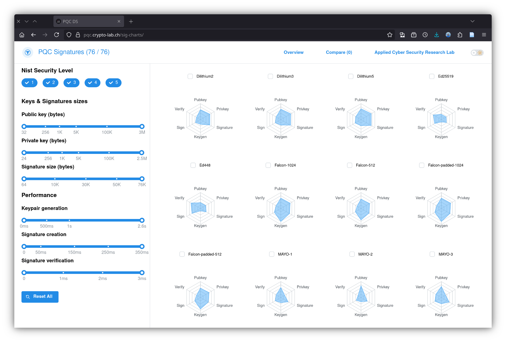

# pqc-sig-charts-website

[](https://doi.org/10.5281/zenodo.16981056)
[](https://github.com/cryptohslu/pqc-sig-charts-website/actions/workflows/deploy.yml)



Source code of the Plotly/Dash visualization website for PQC signature algorithms.

## Quick start

```console
$ git clone https://github.com/cryptohslu/pqc-sig-charts-website.git
$ cd pqc-sig-charts-website
$ ./run.sh
```

## Systemd units

- `pqc-sig-charts.service`: Unit that starts the Gunicorn server running the webapp
- `pqc-sig-charts-restart.service`: Auxiliary unit to restart the main service
- `pqc-sig-charts-restart.timer`: Timer that waits 30 seconds to trigger the auxiliary restart unit
- `pqc-sig-charts-debounce.path`: Unit that monitors the webapp directory for changes
- `pqc-sig-charts-debounce.service`: Unit that resets the restart timer back to 30 seconds

To enable them, copy both files to `/etc/systemd/system/` and run

```console
# systemctl enable --now pqc-sig-charts.service
# systemctl enable --now pqc-sig-charts-debounce.path
```
